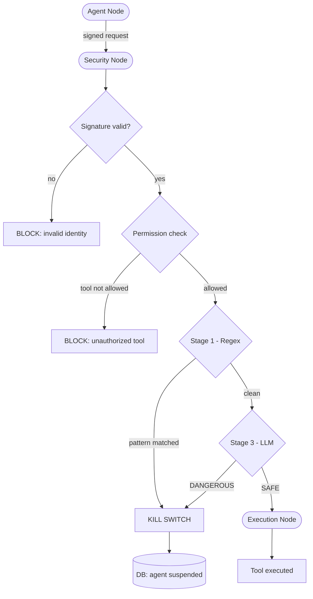

# Agent Security Framework

A Zero Trust security middleware for multi-agent LangGraph architectures. The system intercepts and blocks malicious actions at runtime before they are executed.

## Architecture

The framework is composed of 5 core modules:

- **Key Authority** - Manages cryptographic identity. Each agent has a persistent Ed25519 key pair. Every request is signed by the agent and verified by the system before processing.
- **Agent Registry** - SQLAlchemy/SQLite persistent database storing agent ID, risk level, granular permissions, and status (active/suspended).
- **Security Interceptor** - Evaluates every tool call through a 2-stage detection pipeline before execution.
- **Audit Trail** - Immutable DB logging with hash chaining. Each record includes the hash of the previous record, guaranteeing forensic integrity.
- **LangGraph Orchestration** - A 3-node graph: Agent Node (signs the request), Security Node (verifies signature and runs detection), Execution Node (runs the tool only if authorized).

## Detection Pipeline

1. **Stage 1 - Regex**: Immediate block on known patterns (SQL injection, prompt injection, privilege escalation).
2. **Stage 3 - LLM**: If input passes regex, a local Gemma 3 model via LM Studio performs semantic intent analysis.

## Kill Switch

If a semantic attack is detected, the agent is permanently suspended in the database. A suspended agent cannot re-register a new key. Human operators can reinstate an agent via unsuspend_agent.py, satisfying EU AI Act Art. 14 human oversight requirements.

## Setup

Install dependencies:

    pip install -r requirements.txt

Start LM Studio locally with the Gemma 3 4B model on port 1234.

Run the full demo (resets DB, configures agents, runs all scenarios):

    python setup_and_run.py

Start the audit dashboard (separate terminal):

    python server.py

Open http://localhost:8000/audit in your browser (credentials: admin / asf-secret-2024).

## Demo Scenarios

- **Safe operation** - triage_agent sends a legitimate communication.
- **Privilege escalation** - analytics_agent attempts to call issue_refund without permission.
- **Semantic attack** - billing_agent tries DROP TABLE, triggering the kill switch.
- **Persistence** - suspended billing_agent is blocked even on a safe subsequent request.

## Human Oversight

    python unsuspend_agent.py <agent_id>

## Project Structure

- audit.py - Immutable hash-chained audit trail
- graph_framework.py - LangGraph orchestration
- interceptor.py - 2-stage security detection pipeline
- key_authority.py - Ed25519 key management with persistence
- registry.py - Agent registry and permissions
- validator.py - Inter-agent message validation
- server.py - FastAPI audit dashboard
- setup_and_run.py - One-command demo setup and execution
- unsuspend_agent.py - Human oversight reinstatement tool
