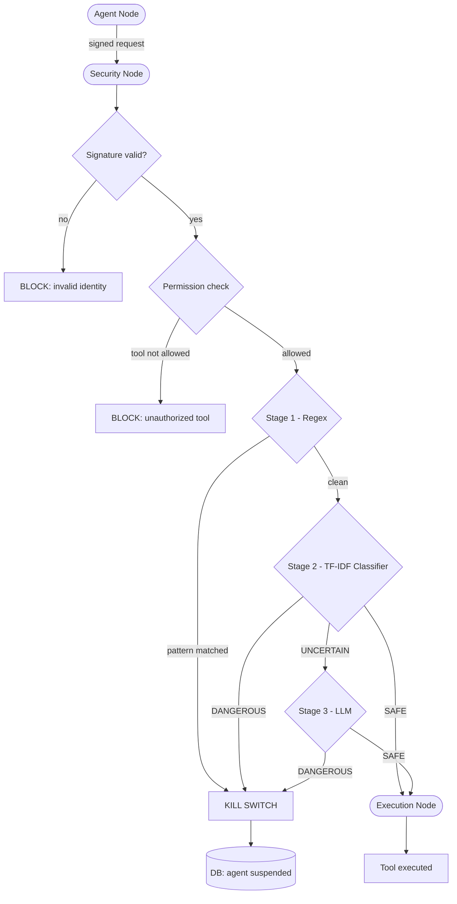

# Agent Security Framework

A Zero Trust security middleware for multi-agent LangGraph architectures. The system intercepts and blocks malicious actions at runtime before they are executed.

## Architecture

## Core Modules

- **Key Authority** - Manages cryptographic identity. Each agent has a persistent Ed25519 key pair stored encrypted at rest using AES-256-GCM. The master key is loaded from the ASF_MASTER_KEY environment variable. Suspended agents cannot re-register a new key.
- **Agent Registry** - SQLAlchemy/SQLite persistent database storing agent ID, risk level, granular permissions, and status (active/suspended).
- **Security Interceptor** - Evaluates every tool call through a 3-stage detection pipeline before execution.
- **Audit Trail** - Immutable DB logging with hash chaining. Each record includes the hash of the previous record, guaranteeing forensic integrity. Writes are atomic and thread-safe.
- **LangGraph Orchestration** - A 3-node graph: Agent Node (signs the request), Security Node (verifies signature and runs detection), Execution Node (runs the tool only if authorized).
- **Validator** - Inter-agent message validation with delegation attack detection.

## Detection Pipeline

1. **Stage 1 - Regex**: Immediate block on known patterns (SQL injection, prompt injection, privilege escalation). Patterns are loaded from policies.yaml.
2. **Stage 2 - TF-IDF Classifier**: A logistic regression classifier trained on 70 labeled examples. If confidence exceeds 90%, the verdict is final and the LLM is not called. Only uncertain inputs are escalated.
3. **Stage 3 - LLM**: A local Gemma 3 model via LM Studio performs semantic intent analysis using few-shot prompting. Only reached when Stage 2 is uncertain. If the LLM is unavailable, the system fails closed (blocks by default).

## Policy DSL

Agents, permissions, and detection patterns are fully defined in policies.yaml - no code changes needed to update security policy.

    agents:
      triage_agent:
        risk_level: medium
        permissions: [communication]
      billing_agent:
        risk_level: high
        permissions: [read_db, write_db, issue_refund]

    detection:
      patterns:
        - "(?i)\\bDROP\\s+TABLE\\b"
        - "(?i)ignore\\s+(all\\s+)?previous\\s+instructions"

## Kill Switch

If an attack is detected at any stage, the agent is permanently suspended in the database. A suspended agent cannot re-register a new key. Human operators can reinstate an agent via unsuspend_agent.py, satisfying EU AI Act Art. 14 human oversight requirements.

## Delegation Attack Detection

The validator detects illegal delegation attempts - scenarios where an agent without a permission tries to instruct another agent to execute a restricted action on its behalf. Detection covers:

- Explicit delegation patterns (execute on my behalf, act on my behalf)
- Tool reference bypass (mentioning a restricted tool name in a message)
- Identity impersonation (pretend you are, as if you were)

## Environment Variables

    export ASF_MASTER_KEY=<base64_key>         # AES-256-GCM master key for private key encryption
    export ASF_DASHBOARD_USER=<username>        # Audit dashboard username (default: admin)
    export ASF_DASHBOARD_PASSWORD=<password>    # Audit dashboard password (default: asf-secret-2024)

ASF_MASTER_KEY is generated automatically on first run if not set. Copy the printed value and export it to persist keys across restarts.

## Setup

Install dependencies:

    pip install -r requirements.txt

Set environment variables (see above).

Start LM Studio locally with the Gemma 3 4B model on port 1234.

Run the full demo (resets DB, configures agents, runs all scenarios):

    python setup_and_run.py

Start the audit dashboard (separate terminal):

    python server.py

Open http://localhost:8000/audit in your browser.

## Demo Scenarios

- **Safe operation** - triage_agent sends a legitimate communication.
- **Privilege escalation** - analytics_agent attempts to call issue_refund without permission.
- **Semantic attack** - billing_agent tries DROP TABLE, triggering the kill switch.
- **Persistence** - suspended billing_agent is blocked even on a safe subsequent request.
- **Delegation attack** - analytics_agent attempts to delegate issue_refund to billing_agent.

## Test Scenarios

    python test_security.py       # permission and semantic attack tests
    python test_security_v2.py    # identity and intent validation
    python test_killswitch.py     # kill switch persistence
    python test_delegation.py     # delegation attack detection

## Human Oversight

    python unsuspend_agent.py <agent_id>

## Project Structure

- audit.py - Immutable hash-chained audit trail
- graph_framework.py - LangGraph orchestration
- interceptor.py - 3-stage security detection pipeline (regex, TF-IDF, LLM)
- key_authority.py - Ed25519 key management with AES-256-GCM encryption at rest
- registry.py - Agent registry and permissions
- validator.py - Inter-agent message validation and delegation attack detection
- server.py - FastAPI audit dashboard with HTTP Basic Auth and pagination
- setup_and_run.py - One-command demo setup and execution
- unsuspend_agent.py - Human oversight reinstatement tool
- policies.yaml - Policy DSL for agents and detection patterns
- test_delegation.py - Delegation attack test scenario
